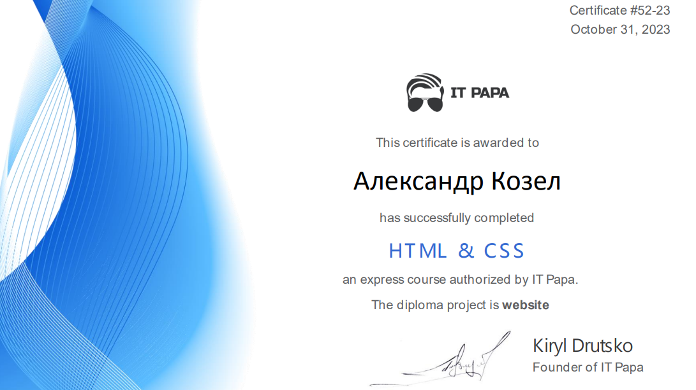

# KOZEL ALEXANDR #
## MY CONTACT INFO ##
* [GitHub](https://github.com/chechen-brother)
* [E-mail](shura.kozel@list.ru)
* iii_alex_iii (discord)
---

## Briefly About Myself: ##
>I'm studying at BSUIR.  I have worked with different programming languages and have some base. And now I started to study Front-end development. My goal is to successfully complete the course from RS school. I do not have more free time, but I have the ambition. Therefore, I will spare no effort to achieve the goal
---

## SKILS ##
* HTML
* CSS
* JavaScript
* Git, GitHub
* C/C++ (basic knowledge), Python(basic knowledge), Java/Kotlin(basic knowledge)
* SQL
* VSCode, PyCharm community, IntelliJ IDEA, Postgresql
---

## Code Examples ##
```
function findMissingLatters(letters) {
    let alphabet = [];
    for (let i = 97; i <= letters[letters.length - 1].charCodeAt(); i++) {
        alphabet.push(String.fromCharCode(i));
    }
    return alphabet.filter((el) => {
        if (letters.includes(el))
            return false;
        return true;
    });
}
```
## COURCES ##
* HTML and CSS cource on [ItPapa](https://www.itpapa.org/)
    
* [RS Schools](https://app.rs.school) Course «JavaScript/Front-end. Stage 0» (in progress)
* Udemy cource "Full Python 3 Course from Beginner to Master"
---
## Languages ##
* Russian
* Belarusian
* English (learned at university)
* German (learned in school)